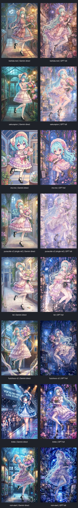

# 2026-09-27 横向对比：Gemini 直出 vs GPT 全链路

同一份人物、动作、服装、场景内容锚；所有组均带各自画风参考图。左列为 Gemini 单独生成（参考图优先），右列为 GPT 首图 + Gemini 完整画风重绘 + 质量/身份门禁的最终选中图。

## 单图查看

| 画风 | Gemini 直出（参考图优先） | GPT 全链路最终图 |
| --- | --- | --- |
| kishida-mel | [打开原图](../../data/test-result/20260927/expanded-horizontal/gemini/kishida-mel-style/C_kishida-mel-style_style_ref_test_011058-673dc3.jpg) | [打开原图](../../data/test-result/20260927/expanded-horizontal/gpt-full/kishida-mel-style/quality-refine_011926-676480.jpg) |
| sakurapion | [打开原图](../../data/test-result/20260927/expanded-horizontal/gemini/sakurapion-style/C_sakurapion-style_style_ref_test_011118-62e7f3.jpg) | [打开原图](../../data/test-result/20260927/expanded-horizontal/gpt-full/sakurapion-style/quality-refine_013918-a521d7.jpg) |
| iris-mix | [打开原图](../../data/test-result/20260927/expanded-horizontal/gemini/iris-mix-style/C_iris-mix-style_style_ref_test_011139-47b416.jpg) | [打开原图](../../data/test-result/20260927/expanded-horizontal/gpt-full/iris-mix-style/20260926-232324-be2c69cd_output_013648_0_1c13f2-013658-45fc37-final-rp+tone+ink.png) |
| puracotte-v2（新单人参考） | [打开原图](../../data/test-result/20260927/expanded-horizontal/gemini/puracotte-style-v2-single-ref/C_puracotte-style-v2_style_ref_test_012815-a288a1.jpg) | [打开原图](../../data/test-result/20260927/expanded-horizontal/gpt-full/puracotte-style-v2-single-ref/quality-refine_014440-84b34b.jpg) |
| tid | [打开原图](../../data/test-result/20260927/expanded-horizontal/gemini/tid/C_tid_style_ref_test_011223-a27941.jpg) | [打开原图](../../data/test-result/20260927/expanded-horizontal/gpt-full/tid/identity-correct-1_015004-89ee58.jpg) |
| fuzichoco-v2 | [打开原图](../../data/test-result/20260927/expanded-horizontal/gemini/fuzichoco-v2/C_fuzichoco-v2_style_ref_test_011254-cf4f41.jpg) | [打开原图](../../data/test-result/20260927/expanded-horizontal/gpt-full/fuzichoco-v2/quality-refine_015322-70e7eb.jpg) |
| tinkle | [打开原图](../../data/test-result/20260927/expanded-horizontal/gemini/tinkle/C_tinkle_style_ref_test_011312-434e9b.jpg) | [打开原图](../../data/test-result/20260927/expanded-horizontal/gpt-full/tinkle/quality-refine_015817-0a3886.jpg) |
| noir-aiart | [打开原图](../../data/test-result/20260927/expanded-horizontal/gemini/noir-aiart/C_noir-aiart_style_ref_test_011407-e5cb7a.jpg) | [打开原图](../../data/test-result/20260927/expanded-horizontal/gpt-full/noir-aiart/quality-refine_020221-78f623.jpg) |

## 本轮需要重点观察的异常

- `tinkle / Gemini 直出` 把内容改成演唱会舞台并加入文字与观众，违反场景锁；它不是参考图内容的直接复制，更像由“长青色头发”触发的角色/题材先验。
- `puracotte-v2 / GPT 全链路` 的旧 `face_hair_refine` 会大幅搬入新参考图的紫发、伞和人物构图；最终身份门禁虽然恢复了内容，但该额外工序已在配置中关闭。
- `tid / GPT 全链路` 的重绘后发色发生偏移，最终由身份修订恢复为青绿色；说明全链路仍需要身份门禁。
- `kishida-mel` 与 `sakurapion` 的质量门禁会检查并修订过长腿和过小头；`iris-mix` 保留独立 Q 版比例，不套成人比例规则。
