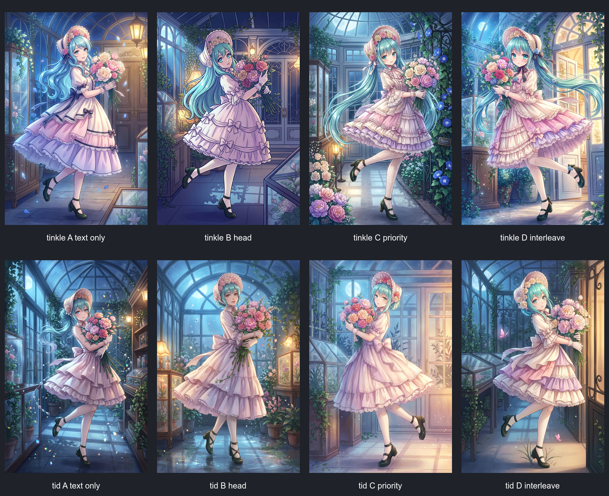
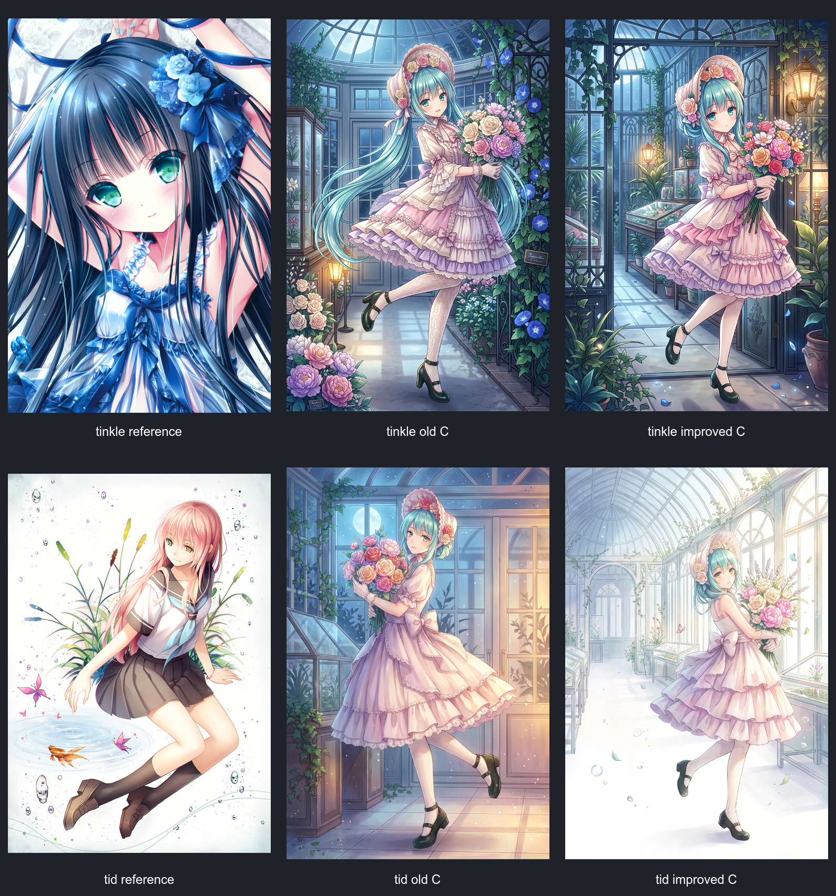
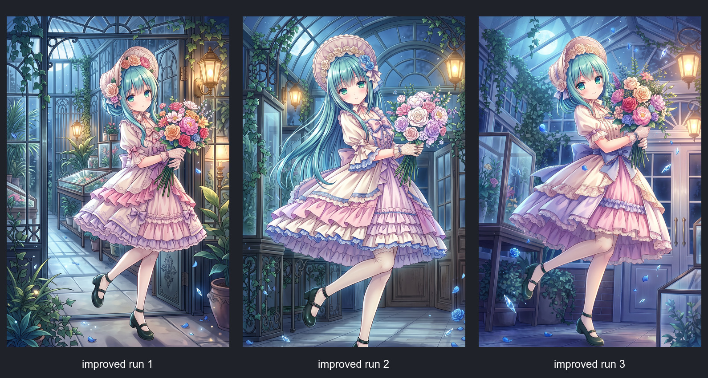
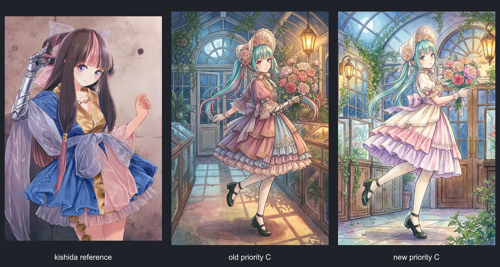

# Gemini 直出画风相似度回归与修订（2026-09-27）

## 结论

9 月初的请求回放会把完整画风说明（样本约 8.9k 字符）与参考图一并发送。9 月 27 日基线的「参考优先」改为约 500–700 字符的 `prompt_gpt` 八字段摘要；它能保持内容，但省略了脸、眼睛、头发等作者辨识度最高的画法，因此多种画风退化成只有配色接近的通用商业动漫风。

修订后增加可选 `prompt_gemini`：仅配置过并实测的画风使用中等长度 Gemini 身份锚；其他画风继续沿用既有 `prompt_gpt`，不做未经验证的全局切换。GPT-image 通道仍只读 `prompt_gpt`。

## 评估模型

`tests/calc_style_similarity.py` 现在使用两套互补判据：

- 本地总分：ResNet 早/中层 Gram 纹理统计 55% + HSV 20% + 多尺度边缘、线色、对比和饱和结构 25%。
- 视觉审计：按脸部抽象、眼睛语言、头发语言、线与边缘、色光、材质细节分别评分，并单列内容服从和参考内容泄露。
- CLIP 只保留为诊断值，不参与总分；全局 CLIP 会把共同的“动漫少女”语义误判成画风相似。
- ORB 只报告近似像素复制风险，不作为画风奖励。

## 四模式基线

同一内容锚分别测试：A 纯文字无图、B 头部插入、C 参考优先、D 图文交错。

- tinkle：旧 C 本地总分 0.8218，D 0.7963。视觉审计认为 C/D 最接近，但都未充分还原参考图的夸张宝石眼、深色发束和高光语法。
- tid：旧 C 本地总分 0.7052，纯文字 A 0.6998；视觉审计中所有旧模式仍偏暗、偏复杂，与参考图高亮留白差距明显。
- 模式优劣不是全局常量；决定相似度的是「参考图 + 该 style 的身份锚」组合。

## 定点修订结果

- tinkle：本地总分 0.8218 → 0.8316；视觉审计改进版排名第一。补回大眼/虹膜、发束、深靛色线条语法，并禁止舞台、观众、品牌和文字。
- tid：本地总分 0.7052 → 0.8558；视觉审计 69 → 72。大面积留白、细色线、简化环境和稀疏水彩颗粒均明显接近参考图。
- 风格增强会让动作趋于保守；三张 tinkle 改进图都保住温室与单人内容，但动作动态性弱于文字锚，后续仍需把 pose compliance 作为独立门禁。

## tinkle 演唱会异常

坏图和正常旧 C 的两份回放具有完全相同的两段文本 SHA-256、同一张参考图、同一图片顺序和同一模型。演唱会、观众、VOCALOID 文字也不存在于 tinkle 参考图；它更符合“长青色头发 + 模型角色先验”的随机漂移，而不是参考图内容复制。

加入 `no franchise character, concert, stage, audience, signage, logo, readable text` 后连续三次均为单人温室，无舞台、观众或文字：

样本量仍只有 3，不能宣称彻底消除随机漂移。

## 泛化检查

将同一机制用于 kishida-mel，但使用该画风自己的水彩、脸眼、发束和色线身份锚：

本地总分 0.7544 → 0.7604，视觉审计 46 → 47，仅小幅提升。结论是字段机制可复用，但 prompt 内容必须逐画风校准；暂不自动为全部 style 启用。

